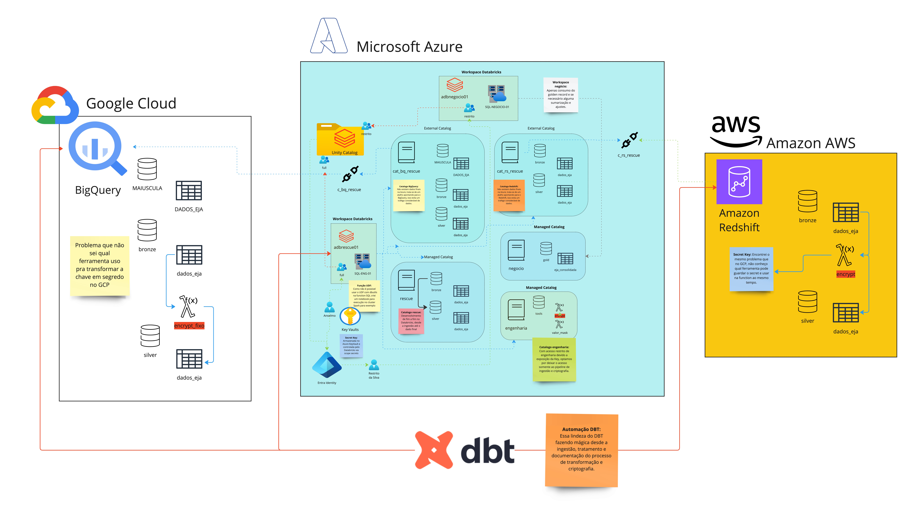
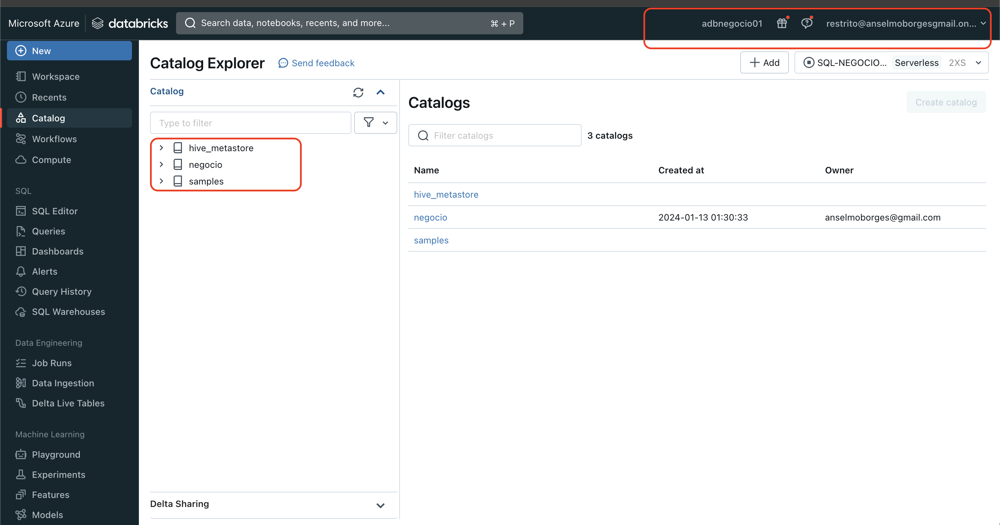
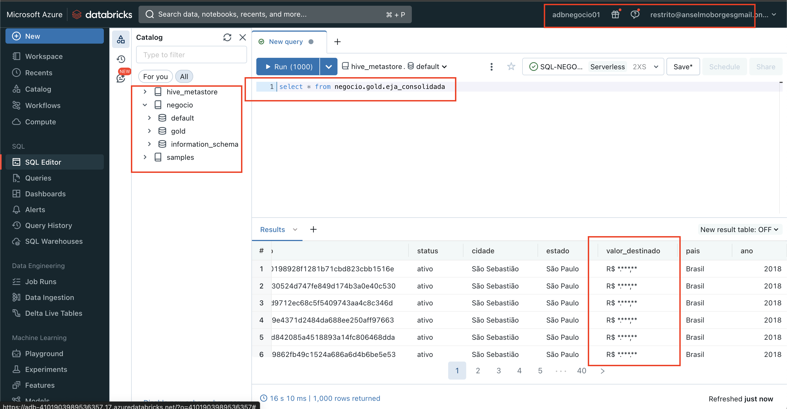

Bem vindo ao meu projetinho malandro...

# Criptografia Unificada feat. (Unity Catalog e DBT)
* **Criado por:** Anselmo Borges
* **Data de criação:** 12.01.2014
* **Ultima atualização:** 14.01.2014

Esse projeto foi criado com o intuito de validar uma POC de integração entre clouds usando o Unity Catalog e acabou virando bem mais que isso, acabei resolvendo um problema antigo que tinha na Porto que era a ineficiencia de comunicação entre lakes Cloud. Na Porto o primeiro lake de dados nasceu na GCP e com o tempo outras fontes de dados foram surgindo como Azure e AWS, havendo hoje dados nas 3 clouds que não se falam.

Fora isso existem dados no ambiente on premisses onde a ingestão vem ocorrendo parte na GCP e parte comigo na Azure.

## Features destravadas
Como disse nesse projeto acabamos de fazer uma série de coisas bacanas como:
* Na Azure:
  * Configuração de Storage Account e containers (Metadados e Áreas Bronze e Silver)
  * Criação do connector Databricks para o Unity Catalog
  * Permissionamento no Storage Acccount
  * Criação de Workspace Databricks
  * Criação de Azure KeyVault, atribuição de privilégios para o managed identity do Databricks e secret

* No Databricks:
  * Criação do Metastore do Unity Catalog e vinculo nas Workspaces
  * Controle de acesso com grupos e usuários distintos por Workspaces
  * Criação de External Storage para os Databases Bronze e Silver de acordo com os containers
  * Criação de secret scope com Azure KeyVault
  * Configuração do `databricks-cli`
  * Criação de function SQL de criptografia no Unity Catalog
  * Restrição de acessos a catalogos por Workspaces
  * Restricão de usuários a determinados catalogos via Unity Catalog
  * Criptografia de dados sensiveis
  * Mascaramento de dados sensiveis por grupo de acesso
  * Criação de External Catalogs (BigQuery e Redshift)

* No BigQuery:
  * Criação de Dataset
  * Crição de funções
  * Geração de key json de acesso e privilégios necessários
  * Salvamento de consultas e execução remota

* No Redshift
  * Criação de ambiente Redshift
  * Liberação de acesso publico via NSG
  * Criação de função de criptografia

* No DBT-CORE:
  * Minha primeira experiência real com DBT core (nem é a versão paga) e tô completamente apaixonado.
  * Instalação do DBT-CORE local
  * Conexão com as 3 bases do projeto (Databricks, BigQuery e Redshift)
  * Ingestão de dados via `dbt seed`
  * Criação de módulos e vinculo entre eles
  * Customização em casos de multiplos Schemas
  * Criação de documentação básica

**POUCA COISA NÉ! E ISSO ACONTECEU TUDO NUM FINAL DE SEMANA OCIOSO!**

## Desenho do projeto
Segue abaixo um desenho para um entendimento melhor do projeto e o que vamos fazer.



## Cronograma
O passo a passo para a construção desse ambiente vai partir do pré requisito que ja temos algumas das peças configuradas (pra efeito de uma apresentação mais rápida), com o tempo vou criando um roteirinho de como montei do zero, mas vou levar em consideração que você:

* Já tem o Big Query, user de serviço e a chave JSON criados
* Já tem o Redshift e liberou acesso público
* Já tem o Storage Account, containers e privilégios setados
* Já criou o Unity catalog nos 2 Workspaces 
* Já configurou os grupos de acessos
* Já criou os SQL Warehouses nos 2 Workspaces e já mudou pra Premium pra usar serveless
* Já tem os Tokens Databricks em mãos
* Já criou os externals Catalogs e Externals storages no Unity
* Já criou os Catalogos
  * cat_bq_rescue
  * cat_rs_rescue
  * engenharia (o da função)
  * rescue
* Ja criou os Databases no catalogo rescue
  * bronze (apontando pro external storage do container bronze)
  * silver (apontando pro external storage do container silver)
* Já instalou o DBT Core e os plugins para:
  * Redshift
  * Databricks
  * Big Query
* Ja configurou as conexões com os 3 bancos

Peço desculpas não mostrar esses pontos agora, preciso fazer a apresentação dessa solução na Porto essa semana, mas depois acrescento esses materiais não menos importantes pra que você possa simular ai no seu ambiente e ficar feliz igual eu tô.


Então sem demora vamos começar pelo BigQuery:

### Big Query
Vamos partir do principio que o BigQuery tá zerado e você tem todos os privilégios de BigQuery Admin.

#### Criando o schema de engenharia e a função
Nos 3 ambientes vamos criar um schema de engenharia, esse schema tem o intuito de armazenar a função de criptografia `encrypt`, a idéia e pra segmentar acesso já que ela tem uma chave que pode ser vista caso o usuário tenha acesso a ela, a ideia é que só o usuário do pipe tenha privilégio a ela e mais ninguem, ou seja, bronze e silver é de engenharia e engenharia deveria pelo menos ser autimatizada.

Vamos rodar o script abaixo via UI do BigQuery mesmo:
```
Create schema engenharia;

CREATE OR REPLACE FUNCTION `integracao-bq.engenharia.encrypt`(input_string STRING) RETURNS STRING AS (
(SELECT TO_HEX(MD5(CONCAT(input_string, 'E3GD8uPL0AFwLbYtGQx1HHqOvZ9jROnAnEbtUSLdhyI'))))
);
```
Esse comando cria tanto o schema quanto a função.

No BigQuery encerramos por enquanto.

### Redshift:
No Redshift também vamos partir do principio que você tem os acessos necessários e está acessando pelo Query Editor V2 (é um editor nativo da AWS pra rodar as queries no Redshift)

Rode o comando abaixo para criar o database `rescue`:
```
create database "rescue";
```
Altere agora no Query editor o Database que você está logado vai aparecer `rescue` e `dev`, escolha `rescue` e em seguida rode esse novo comando para criar os schemas `tools`,`bronze` e `silver`.
```
create schema tools;
create schema bronze;
create schema silver;
```
Agora com os schemas criados crie a função:

```
CREATE OR REPLACE function engenharia.tools.crypto(input_string VARCHAR)
RETURNS VARCHAR
IMMUTABLE
LANGUAGE plpythonu
AS $$
import hashlib

key = 'E3GD8uPL0AFwLbYtGQx1HHqOvZ9jROnAnEbtUSLdhyI'

salted_text = input_string + key
hashed_text = hashlib.md5(salted_text.encode()).hexdigest()
return hashed_text
$$;
```
Feito isso encerramos no Redshift também por enquanto.

### Databricks
Já deixei pronto o catalogo `rescue` e os databases `bronze`, `silver` e `gold` (sim, aqui vai ter o Gold, pois vamos criar nosso Golden Record), pois os mesmos tem uma configuração especifica que apontam para um external storage que criei. O catalogo e o database de engenharia já não tem muito luxo e podemos criar tudo via comando.

```
create catalog engenharia;
create schema engenharia.tools;
CREATE OR REPLACE FUNCTION engenharia.tools.encrypt(input_string STRING)
RETURNS STRING
LANGUAGE PYTHON
AS $$
  import hashlib

  key = 'E3GD8uPL0AFwLbYtGQx1HHqOvZ9jROnAnEbtUSLdhyI'
  
  salted_text = input_string + key
  hashed_text = hashlib.md5(salted_text.encode()).hexdigest()

  return hashed_text
$$;
```
Bem mais fácil no Databricks! Encerramos por aqui também!

### DBT
Agora que já temos os 3 bancos das 3 cloud preparados com os databases e funções de criptografia criados, estou partindo da premissa que os 3 projetos daqui já estão configurados com seus respectivos databases:
* **bronze_adb** - Conectado com o Databricks
* **bq_create** - Conectado com o BigQuery
* **rs_create** - Conectado com o Databricks


A ordem que vamos rodar será a seguinte:
1. BigQuery
2. RedShift
3. Databricks

Vamos levar em consideração que o nosso diretório rais é o `dbtzin` as respectivas pastas de cada projeto estão nesse diretório.

#### BigQuery
Pra entrar na pasta dê um `cd bq_create` e vamos rodar 2 comandos (se você não rodar na pasta vai dar merda, pois ele não encontra o `dbt_project.yml`):
* `dbt seed` - Comando mais que malandro que já faz a ingestão do nosso dado pra tabela Bronze
* `dbt run` - Comando que roda o pipeline real, ele cria a tabela silver já usando a function de criptografia.

Vamos rodar 2 comandinhos extra que vai gerar a documentação pra gente dar uma olhada:
* `dbt docs generate` - gera a documentação das tabelas criadas
* `dbt docs serve` - Sobe um serviço web na porta 8080 pra visualizar a documentação, pra sair basta dar `CTRL + C`

Com isso criamos as 2 tabelas dá uma conferida lá que foda, ele cria também um schema MAIUSCULO que vou explicar quando chegar no Databricks.

#### Redshift
Pra entrar na pasta dê um `cd rs_create` e vamos rodar 2 comandos (se você não rodar na pasta vai dar merda, pois ele não encontra o `dbt_project.yml`):
* `dbt seed` - Comando mais que malandro que já faz a ingestão do nosso dado pra tabela Bronze. Eu achei muito foda ele fazer isso no Redshift pois a primeira vez que fiz, fiz na mão, foi um parto, IAM, editor de bosta do Redshift e mais dor de cabeça, por ai o cara sobe liso e em segundos. DBT é vida <3
* `dbt run` - Comando que roda o pipeline real, ele cria a tabela silver já usando a function de criptografia.

Vamos rodar 2 comandinhos extra que vai gerar a documentação pra gente dar uma olhada:
* `dbt docs generate` - gera a documentação das tabelas criadas
* `dbt docs serve` - Sobe um serviço web na porta 8080 pra visualizar a documentação, pra sair basta dar `CTRL + C`

Com isso criamos as 2 tabelas, uma no schema bronze e a criptografada na silver.

#### Databricks:
Por fim vamos fazer tudão, mas vou explicar o que esse do Databricks faz:
1. Ele não puxa os dados usando seed, optei por fazer uma copia do external catalog do Unity com a base fo BigQuery só pra você pirar no poder disso.
2. Ele cria a camada silver já criptografando
3. Vamos rodar um outro projeto chamado `gold_adb` que vai cria nosso golden record, mas jájá falamos dele.

Vamos por pra rodar então:
Pra entrar na pasta dê um `cd bronze_adb` (não mudei o nome que fiquei com preguiça) e vamos rodar 2 comandos (se você não rodar na pasta vai dar merda, pois ele não encontra o `dbt_project.yml`):
* `dbt run` - Comando que roda o pipeline real, ele cria a tabela silver já usando a function de criptografia e nesse caso faz a gold também.

Vamos rodar 2 comandinhos extra que vai gerar a documentação pra gente dar uma olhada:
* `dbt docs generate` - gera a documentação das tabelas criadas
* `dbt docs serve` - Sobe um serviço web na porta 8080 pra visualizar a documentação, pra sair basta dar `CTRL + C`

Valide se criou tudo nos 3 bancos, veja se está tudo certinho (eu sei que tá, rs) e vamos rodar a Gold que faz o que?

**Criamos o nosso produto de dados na camado gold, fazendo um Join das 3 tabelas (Databricks, RedShift e BigQuery, fala se não é foda?). Vou além, ele faz o Join pela chave de criptografia UNICA nas 3!**


Pra entrar na pasta dê um `cd gold_adb` e vamos rodar 1 comando (se você não rodar na pasta vai dar merda, pois ele não encontra o `dbt_project.yml`):
* `dbt run` - Comando que faz o Join da porra toda e gera a tabela no catalogo negócios e no database Gold.

O monstrinho que criei nessa ultima etapa faz o seguinte:
1. Cria views (pensei em fazer temp view mas pra fins didáticos optei por views convencionais, pra gente ver o lineage da tabela final). São criadas 3 views uma para a silver de cada um dos bancos (Redshift, BigQuery e Databricks).
2. Criei um modelo pra cada um deles pra que eu posssa referenciar no modelo final que é o `eja_consolidada`.

Vamos rodar 2 comandinhos extra que vai gerar a documentação pra gente dar uma olhada:
* `dbt docs generate` - gera a documentação das tabelas criadas
* `dbt docs serve` - Sobe um serviço web na porta 8080 pra visualizar a documentação, pra sair basta dar `CTRL + C`

**OBS:** Aproveite para comparar o lineage do DBT dessa tabela final mas aproveite pra ver o Lineage do Unity Catalog que é muito mais completo.

Em resumo o DBT é um monstro gratuito, o ponto negativo é que não tenho um portal centralizado dessa documentação trabalhando com DBT-CORE, teria que pagar uma licença e centralizar o desenvolvimento da gelera lá, como estou trabalhando com 3 bancos em 3 clouds diferentes, muda o banco, muda o catalogo, muda o projeto.

Fiquei chocado com o tempo de implantação de tudo depois de feito, a possibilidade do controle de versão e o quão incrivel deve ser o CI/CD dessa implementação.

## Criando a função de controle de acesso e mascaramento
Com essa tabela `eja_consolidada` criada vou sugerir um cenário:

**Os dados do INEP já se encontram criptografados, vou restringir o acesso de visualização do valor, para um determinado grupo de usuários do Unity Catalog, mascarando o `valor_destinado` exibindo `R$ **.****.**`, querem apostar?

Tenho os seguintes grupos criados:
* admin - onde estou eu Anselmo
* restrito - onde está o usuário **Restrito da Silva**

Esses grupos são do Unity Catalog mas estão vinculados a usuários do Active Directory, mudou o grupo no AD muda o acesso. O Acesso desse user vai estar restrito ao Workspace Databricks dele e ele vai ver só a tabela Gold dele, nesse Workspace tem um SQL Warehouse pequeno, ele não precisa de um cluster Spark ou qualquer outro tipo de feature muito cara do Databricks. Se liga como fica limitado.


Pra que isso funcione, vamos criar uma função lá no `engenharia`.`tools`, onde colocamos nossa function de criptografia (lembrando que os acessos a elas ficam restritos a engenharia). Levando em consideração que tenho os pré requisitos feitos, vamos criar a função e aplicar na tabela.
```
create or replace function engenharia.tools.valor_mask(valor string)
return case when IS_ACCOUNT_GROUP_MEMBER('full') then valor else "R$ *.***,**" END;
```

Agora com a função criada vamos alterar a tabela `negocio.gold.eja_consolidada` na coluna `valor_destinado`:
```
alter table
  negocio.gold.eja_consolidada
alter column
  VALOR_DESTINADO
set
  mask engenharia.tools.valor_mask;
```

### Validando o mascaramento
Agora vamos ver se vai funcionar, numa aba anônima de preferência logamos com o usuário `Restrito da Silva` no Workspace Databricks `adbnegocio01` e rodamos uma query na tabela `eja_consolidada`, o resultado tem que ser o da imagem abaixo:



## Validação
Vale a pena ver se os dados batem em todas as tabelas, pra isso vamos fazer um count dos registros unicos de cada uma das tabelas pra ver se bate com o resultado final, faça com o user administrativo.
```
select 
(select count(distinct INEP) from rescue.bronze.dados_eja) as tabela_bronze_databricks,
(select count(distinct INEP) from cat_bq_rescue.bronze.dados_eja) as tabela_bronze_bq,
(select count(distinct INEP) from cat_rs_rescue.bronze.dados_eja) as tabela_bronze_rs,
(select count(distinct INEP) from negocio.gold.eja_consolidada) as tabela_consolidada_adb_bq
```

Se deu **10.205** registros deu tudo certo.

## Finalizando
Obrigado e parabéns se acompanhoou até aqui! Que esse material seja muito útil pra você!
Dê uma moralzinha lá nos canais da Rescue no Youtube e Medium e me segue lá no Linkedin.

Abraço!